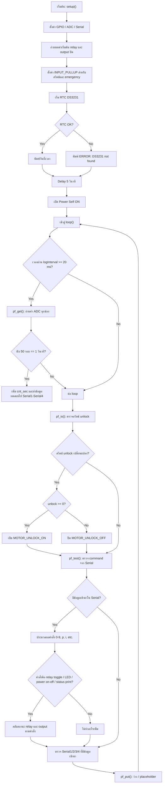

# Power Module Arduino Flow

## Flowchart



## คำอธิบายโค้ด

โค้ดนี้เป็น Arduino firmware สำหรับจัดการการเปิด/ปิดพลังงานของ power module โดยมีหน้าที่หลักดังนี้:

1. ควบคุม relay ที่เชื่อมต่อกับแบตเตอรี่, charger, motor driver, controller และ auxiliary device
2. อ่านค่า ADC เพื่อคำนวณแรงดันและกระแสในแต่ละเส้น
3. ตรวจสถานะปุ่ม/สวิตช์ เช่น unlock, emergency, power off
4. รับคำสั่งจาก Serial เพื่อสลับสถานะ hardware ในแบบ interactive
5. ส่งข้อมูล telemetry หรือ debug ไปยัง Serial และ Serial1-Serial4

---

## 1) setup()

ในฟังก์ชัน setup() จะทำงานครั้งเดียวตอนบอร์ดเริ่มทำงาน ได้แก่:

- ตั้งค่า ADC ความละเอียดเป็น 12-bit
- ตั้งค่า GPIO สำหรับ LED สีแดง/เขียว/น้ำเงิน เป็น output
- ตั้งค่า output ที่เกี่ยวกับ relay ให้เริ่มต้นเป็น OFF
- ตั้งค่า pin ของสวิตช์และ emergency เป็น INPUT_PULLUP
- เริ่มต้น Serial กับ Serial1-Serial4 เพื่อใช้สื่อสารกับอุปกรณ์ต่าง ๆ
- รอ RTC DS3231 ทำงาน หากเจอ chip จะแสดงวันเวลา หากไม่เจอจะแจ้ง error
- หลัง delay 5 วินาที จะเปิด POWER_SELF_ON เพื่อให้ power module เริ่มทำงานจริง

สังเกตว่าโค้ดมี macro หลายตัว เช่น:

- POWER_BATTERY_CONNECT / DISCONNECT
- POWER_CHARGER_CONNECT / DISCONNECT
- POWER_MOT_DRV_CONNECT / DISCONNECT
- POWER_CONTROL_CONNECT / DISCONNECT
- POWER_AUX_DEV_CONNECT / DISCONNECT

ซึ่งใช้แปลงลอจิกการควบคุม relay ให้เป็นคำสั่งที่เข้าใจง่ายและแก้ไขได้ง่าย

---

## 2) loop()

loop() เป็นโครงสร้างหลักที่ทำงานซ้ำอย่างต่อเนื่อง:

- ทุก 20 ms จะเรียก pf_get() เพื่ออ่านค่า ADC
- ถ้าผ่าน 50 รอบ (≈ 1 วินาที) จะเพิ่ม cnt_sec และส่งข้อความทดสอบไปยัง Serial1, Serial2, Serial3, Serial4
- หลังจากนั้นจะเรียก pf_io() และ pf_test() และ pf_put() ตามลำดับ

เหตุผลของการใช้ logInterval = 20 ms คือเพื่อจำกัดความถี่การอ่าน ADC และลดการรบกวนกับงาน RTOS/loop timing ของบอร์ด

---

## 3) pf_get()

ฟังก์ชันนี้ทำหน้าที่อ่านค่า analog จากทุกช่องตามตาราง ADC:

- MES_I_AUX
- MES_V_AUX
- MES_I_CON
- MES_V_CON
- MES_I_MOT
- MES_V_MOT
- MES_I_CHR
- MES_V_CHR
- MES_I_BAT
- MES_V_BUS
- MES_V_BAT
- MES_V_GNDC
- MES_V_GNDD

คำสั่งที่สำคัญคือ:

```cpp
analogValue[i] = analogRead(A0 ... A12);
phisicalValue[i] = (analogValue[i] - ADC_OFFSET[i]) * ADC_GAIN[i];
```

หมายความว่า:

- อ่านค่าสัญญาณดิบจาก ADC
- ลบ offset ที่กำหนดไว้แล้ว
- คูณด้วย gain เพื่อแปลงเป็นค่าที่เป็นจริง เช่น Volt หรือ Ampere

ค่าที่คำนวณแล้วจะถูกเก็บใน array `phisicalValue[]` เพื่อใช้ใน debug, monitoring หรือแสดงผลต่อไป

---

## 4) pf_io()

ฟังก์ชันนี้ตรวจสอบสถานะของ switch unlock:

```cpp
int t_sw_req_unlock = READ_SW_UNLOCK;
if (t_sw_req_unlock != sw_req_unlock) {
  sw_req_unlock = t_sw_req_unlock;
  if (sw_req_unlock == 0) {
    MOTOR_UNLOCK_ON;
  } else {
    MOTOR_UNLOCK_OFF;
  }
}
```

ความหมาย:

- ถ้าพบว่า switch unlock เปลี่ยนสถานะ
- จะเปิดหรือปิด relay/ขา `PIN_UNLOCK_MOTOR` ตามค่าใหม่
- ใช้ `INPUT_PULLUP` ดังนั้นค่า 0 หมายถึงกด/มีสัญญาณ active

ฟังก์ชันนี้มีลักษณะเป็น edge-triggered event detector: ตรวจเฉพาะตอนสถานะเปลี่ยนเท่านั้น ไม่ใช่ทุก loop

---

## 5) pf_test()

นี่คือฟังก์ชันที่ใช้สำหรับ interactive testing และ debug mode มากที่สุด โดยตรวจสอบข้อมูลที่เข้ามาใน Serial, Serial1, Serial2, Serial3, Serial4

### ตัวอย่างคำสั่งที่รองรับ

- `1` : เปิด/ปิด relay battery
- `2` : เปิด/ปิด relay charger
- `3` : เปิด/ปิด relay motor driver
- `4` : เปิด/ปิด relay controller
- `5` : เปิด/ปิด relay AUX device
- `p` : เปิด/ปิด self power
- `6` : เปิด/ปิด motor unlock
- `7` : เปิด/ปิด emergency stop
- `8` : เปิด/ปิด LED button1
- `9` : เปิด/ปิด LED button2
- `i` : แสดงสถานะระบบ + ค่า ADC + เวลา RTC

ตัวอย่างเช่น:

```cpp
if (c == '1') {
  if (power_sw_battery == 0) {
    POWER_BATTERY_CONNECT;
    power_sw_battery = 1;
  } else {
    POWER_BATTERY_DISCONNECT;
    power_sw_battery = 0;
  }
}
```

หมายความว่าเมื่อกด `1` จะ toggle สถานะ relay battery แบบสลับ ON/OFF ทุกครั้ง

### การแสดงสถานะ

เมื่อรับคำสั่ง `i` จะพิมพ์ตามนี้:

- relay status ของแต่ละ channel
- ค่า ADC ของทุกเซนเซอร์
- สถานะของ switch: power off, unlock, emergency
- เวลาจริงจาก RTC

---

## 6) pf_put()

ฟังก์ชันนี้ยังว่างเปล่า (empty) และมีไว้สำหรับ future implementation เช่น:

- ส่งข้อมูลไปยัง MCU อื่น
- เก็บ log ลง EEPROM
- ปล่อยค่าไปที่ CAN bus
- ควบคุม relay ต่อจาก state machine

ตอนนี้ `pf_put()` ไม่มีการทำงานใด ๆ แต่ยืนยันว่า detail pipeline ของโค้ดมีจุดวางเอาไว้สำหรับการส่งข้อมูลออกในอนาคต

---

## 7) printDateTime()

ฟังก์ชันนี้อ่านเวลาจาก RTC DS3231 และ format เป็นรูปแบบ:

```txt
YYYY-MM-DD HH:MM:SS
```

แล้วพิมพ์ลง Serial เช่น:

```txt
RTC: 2026-06-23 11:10:00
```

เป็นฟังก์ชันที่ช่วยให้ทราบว่า power module ระยะเวลาที่ทำงานและสภาวะอุปกรณ์ที่อ่านได้

---

## สรุปกระบวนการทำงานแบบรวม ๆ

ลำดับการทำงานหลักของโค้ดสามารถสรุปได้ดังนี้:

1. เริ่มระบบและตั้งค่า GPIO / relay / serial
2. เริ่ม RTC และแสดงเวลา
3. เปิด self power
4. ใน loop() ทำงานต่อเนื่อง:
   - อ่านค่า ADC
   - ตรวจสวิตช์ unlock
   - รับคำสั่งจาก serial
   - ประมวลผลและสลับ relay
   - แสดงค่า telemetry
5. รอการสั่งงานจากภายนอกหรือเฝ้าตรวจสภาวะ hardware อย่างต่อเนื่อง

ดังนั้นโค้ดนี้จึงเป็นตัวอย่างของ firmware แบบ monitoring + control platform ที่มีความสามารถในการ:

- ตรวจสถานะทางไฟฟ้า
- ปรับการทำงาน relay
- เปิด/ปิดความปลอดภัย (emergency)
- debug ผ่าน Serial และ UART
- เป็น base สำหรับระบบ power management ใน AMR ที่ต้องการความเชื่อถือสูง

---

## หมายเหตุ

โค้ดนี้มีความจำเป็นที่ต้องมีการจัดการความปลอดภัยมากกว่าเนื้อหาการทำงานปกติ เช่น:

- ตรวจสถานะ emergency stop
- ป้องกันการเปิด relay ผิดลำดับ
- จัดการสภาวะแบตเตอรี่ต่ำและ charging state
- เพิ่ม logic สำหรับ state machine ที่ยั่งยืนในการควบคุมพลังงาน

ในเวอร์ชันปัจจุบัน โค้ดยังเป็นโครงสร้าง prototype / hardware test flow มากกว่าระบบ control ที่สมบูรณ์แบบ
